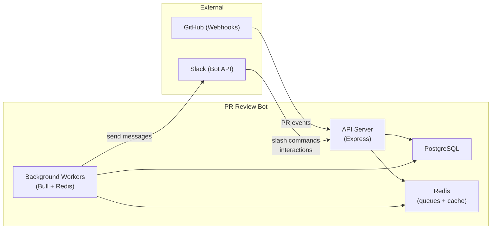
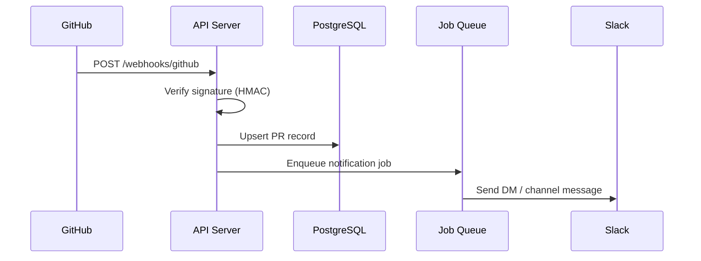
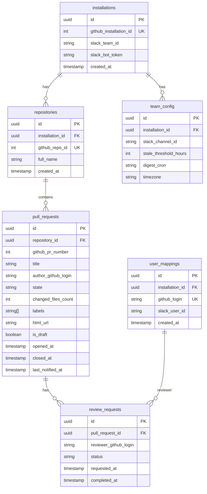

# PR Review Bot — MVP Architecture & Development Plan

A Slack bot that prevents pull requests from being forgotten and optimizes review workflows by integrating with GitHub and Slack.

---

## 1. Architecture Overview

The MVP follows a **webhook-driven, worker-based** architecture. It is simple to build, deploy, and iterate on as a solo developer.



| Layer                  | Responsibility                                                        |
|------------------------|-----------------------------------------------------------------------|
| **API Server**         | Receives GitHub webhooks, handles Slack slash commands & interactions |
| **Background Workers** | Scheduled digests, stale-PR detection, workload analysis              |
| **PostgreSQL**         | Persistent state (PRs, reviewers, teams, config)                      |
| **Redis**              | Job queues (Bull) and short-lived cache                               |

> [!TIP]
> This architecture keeps the API server stateless and fast. All heavy/scheduled logic runs in workers, making it easy to scale each layer independently later.

---

## 2. Recommended Tech Stack

| Concern                    | Choice                                           | Rationale                                                  |
|----------------------------|--------------------------------------------------|------------------------------------------------------------|
| **Language**               | TypeScript (Node.js)                             | Fast iteration, excellent Slack & GitHub SDKs              |
| **Web framework**          | Express                                          | Minimal, well-understood, easy webhook handling            |
| **Slack SDK**              | `@slack/bolt`                                    | Official, handles OAuth, events, slash commands            |
| **GitHub SDK**             | `@octokit/rest` + `@octokit/webhooks`            | Official, typed, handles webhook verification              |
| **Database**               | PostgreSQL                                       | Reliable, great for relational PR/reviewer data            |
| **ORM**                    | Prisma                                           | Type-safe queries, easy migrations, fast dev               |
| **Job queue**              | BullMQ + Redis                                   | Battle-tested, scheduled/recurring jobs, retries           |
| **Deployment**             | Railway or Render                                | One-click deploys, managed Postgres & Redis                |
| **Monorepo**               | Single repo, flat structure                      | Simplest for a solo dev MVP                                |

---

## 3. System Components

```
src/
├── index.ts              # App entrypoint
├── config.ts             # Env vars & configuration
├── server/
│   ├── app.ts            # Express app setup
│   ├── routes/
│   │   ├── github.ts     # GitHub webhook handler
│   │   └── slack.ts      # Slack events/commands handler
│   └── middleware/
│       └── verify.ts     # Webhook signature verification
├── services/
│   ├── pr.service.ts     # PR lifecycle logic
│   ├── reviewer.service.ts   # Reviewer assignment & workload
│   ├── notification.service.ts # Slack message construction
│   └── priority.service.ts    # PR priority scoring
├── workers/
│   ├── stale-pr.worker.ts     # Detects PRs past threshold
│   ├── digest.worker.ts       # Daily digest generation
│   └── workload.worker.ts     # Reviewer imbalance detection
├── integrations/
│   ├── github.ts          # Octokit client wrapper
│   └── slack.ts           # Bolt app wrapper
├── db/
│   ├── prisma/
│   │   └── schema.prisma  # Database schema
│   └── queries/           # Reusable query helpers
└── utils/
    ├── logger.ts
    └── time.ts
```

> [!NOTE]
> Keep it flat and simple. No microservices, no complex abstractions. A solo dev should be able to hold the entire codebase in their head.

---

## 4. GitHub Integration Design

### 4.1 Webhook Events to Subscribe To

| Event                           | Trigger                   | Bot Action                                    |
|---------------------------------|---------------------------|-----------------------------------------------|
| `pull_request.opened`           | New PR created            | Store PR, notify assigned reviewers           |
| `pull_request.review_requested` | Reviewer assigned         | Notify the reviewer in Slack                  |
| `pull_request.closed` / `merged`| PR closed / merged        | Mark PR as resolved, stop notifications       |
| `pull_request_review.submitted` | Review submitted          | Update review status, recalculate workload    |
| `pull_request.labeled`          | Label added               | Check for priority labels (e.g., `urgent`)    |

### 4.2 Webhook Handler Flow



### 4.3 GitHub App vs. OAuth App

> [!IMPORTANT]
> Use a **GitHub App** (not an OAuth App). GitHub Apps have fine-grained permissions, per-repository installation, and higher rate limits. They are the recommended approach for integrations.

**Required Permissions (read-only):**
- `pull_requests: read`
- `metadata: read`

---

## 5. Slack Bot Interaction Model

### 5.1 Message Types

| Message                  | Channel        | Trigger                     |
|--------------------------|----------------|-----------------------------|
| **Reviewer DM**          | Direct message | New review requested        |
| **Stale PR alert**       | Team channel   | PR exceeds wait threshold   |
| **Daily digest**         | Team channel   | Scheduled (cron)            |
| **Workload imbalance**   | Team channel   | Part of daily digest        |

### 5.2 Slash Commands

| Command                              | Description                                  |
|--------------------------------------|----------------------------------------------|
| `/prbot status`                      | Show your pending reviews                    |
| `/prbot digest`                      | Trigger an on-demand digest for your channel |
| `/prbot config threshold 12h`        | Set the stale-PR threshold for the team      |
| `/prbot config channel #engineering` | Set the digest channel                       |

### 5.3 Example Slack Block Kit Message (Daily Digest)

```json
{
  "blocks": [
    {
      "type": "header",
      "text": { "type": "plain_text", "text": "📋 PR Review Digest" }
    },
    {
      "type": "section",
      "text": {
        "type": "mrkdwn",
        "text": "🔴 *High Priority*\n• <https://github.com/org/payment-service/pull/342|payment-service #342> — blocking deployment\n\n⏰ *Waiting > 24h*\n• <https://github.com/org/frontend-ui/pull/112|frontend-ui #112> — opened 32h ago\n\n⚖️ *Reviewer Workload*\n• Alex: 5 reviews pending\n• Marta: 1 review pending"
      }
    },
    {
      "type": "actions",
      "elements": [
        {
          "type": "button",
          "text": { "type": "plain_text", "text": "View All PRs" },
          "url": "https://prbot.app/dashboard"
        }
      ]
    }
  ]
}
```

### 5.4 User Identity Mapping

A critical step is **mapping GitHub usernames → Slack user IDs**. For the MVP:

1. **Slash command**: `/prbot link <github-username>` — users self-link.
2. Store the mapping in a `user_mappings` table.
3. Fall back to posting in the team channel if no mapping exists.

---

## 6. Database Schema



### Key Design Decisions

- **`installations`** — one row per Slack workspace that installs the bot. Stores the GitHub App installation ID and Slack bot token.
- **`review_requests`** tracks each reviewer assignment separately, enabling workload queries.
- **`last_notified_at`** on `pull_requests` prevents notification spam.
- **`team_config`** is per-installation with sensible defaults (24h threshold, 9am digest).

---

## 7. Background Jobs

| Job | Schedule | Logic |
|---|---|---|
| **Stale PR Scanner**    | Every 30 min             | Query `pull_requests` where `state = open` AND `opened_at < NOW() - threshold`. Send alert if `last_notified_at` is null or older than threshold. |
| **Daily Digest**        | Cron (configurable, default 9:00 AM) | Aggregate open PRs by priority, staleness, and reviewer workload. Post Block Kit message to configured channel. |
| **Workload Calculator** | Runs as part of digest | Count open `review_requests` per reviewer. Flag imbalance if max/min ratio > 3:1. |
| **PR Sync**             | Every 6 hours            | Fetch open PRs from GitHub API to catch any missed webhooks or state drift. |

> [!TIP]
> Use BullMQ's built-in **repeatable jobs** for cron schedules. This avoids needing a separate cron scheduler.

---

## 8. Priority Scoring Algorithm

For the MVP, a simple weighted score:

```
priority = 0
if "urgent" or "critical" in labels    → +50
if changed_files_count > 20            → +10
if has_label("blocks-deployment")      → +40
if waiting_hours > 48                  → +20
if waiting_hours > 24                  → +10
if reviewer_count == 0                 → +15
```

PRs with `priority >= 40` are flagged as **high priority** in digests.

> [!NOTE]
> Keep this simple and tune thresholds based on real user feedback. Avoid over-engineering scoring rules before validating the core feature.

---

## 9. Development Roadmap

### Phase 1 — Foundation (Week 1)

| Task | Details |
|---|---|
| Project scaffolding | TypeScript, Express, Prisma, BullMQ |
| Database setup | Schema, migrations, seed data |
| GitHub App registration | Create app, configure webhooks, install on test repo |
| Webhook ingestion | Receive and verify `pull_request` events, store in DB |

### Phase 2 — Slack Integration (Week 2)

| Task                          | Details                                                    |
|-------------------------------|------------------------------------------------------------|
| Slack App creation            | Bot token scopes: `chat:write`, `commands`, `users:read`   |
| Reviewer DM notifications     | On `review_requested`, DM the reviewer                     |
| User mapping (`/prbot link`)  | Slash command to link GitHub ↔ Slack identity              |
| Stale PR alerts               | Background worker + Slack channel post                     |

### Phase 3 — Digest & Workload (Week 3)

| Task                     | Details                                              |
|--------------------------|------------------------------------------------------|
| Daily digest worker      | Aggregate data, build Block Kit message, post to channel |
| Priority scoring         | Implement simple scoring, highlight high-priority PRs |
| Workload imbalance       | Count per-reviewer load, include in digest           |
| `/prbot status` command  | Show personal pending reviews                        |

### Phase 4 — Polish & Ship (Week 4)

| Task                     | Details                                              |
|--------------------------|------------------------------------------------------|
| Error handling & logging | Structured logging, webhook retry idempotency        |
| PR sync worker           | Periodic full-sync to catch missed webhooks          |
| Configuration commands   | `/prbot config threshold`, `/prbot config channel`   |
| Landing page             | Simple page explaining the product + install button  |
| Deploy to production     | Railway/Render with managed Postgres & Redis         |

---

## 10. Deployment Strategy

### Recommended: Railway or Render

Both offer **managed PostgreSQL, managed Redis, and automatic deploys from GitHub** — ideal for a solo dev MVP.

```
┌────────────────────── Railway / Render ──────────────────────┐
│                                                              │
│   ┌──────────┐   ┌──────────┐   ┌──────────┐   ┌──────────┐  │
│   │ API      │   │ Worker   │   │ Postgres │   │ Redis    │  │
│   │ Service  │   │ Service  │   │ (managed)│   │ (managed)│  │
│   └──────────┘   └──────────┘   └──────────┘   └──────────┘  │
│                                                              │
└──────────────────────────────────────────────────────────────┘
```

| Concern           | Solution                                                          |
|-------------------|-------------------------------------------------------------------|
| **API + Workers** | Two separate services in the same repo (different start commands) |
| **Secrets**       | Environment variables via platform dashboard                      |
| **Domain**        | Free subdomain initially, custom domain later                     |
| **SSL**           | Auto-provisioned by platform                                      |
| **CI/CD**         | Push to `main` → auto-deploy                                      |
| **Cost**          | ~$10-20/month on either platform (hobby tier)                     |

### Environment Variables

```
DATABASE_URL=postgresql://...
REDIS_URL=redis://...
GITHUB_APP_ID=...
GITHUB_PRIVATE_KEY=...
GITHUB_WEBHOOK_SECRET=...
SLACK_BOT_TOKEN=xoxb-...
SLACK_SIGNING_SECRET=...
SLACK_APP_TOKEN=xapp-...  (if using socket mode for dev)
```

---

## 11. Idea Validation Playbook

### Step 1 — Dogfood It (Week 1-2 of usage)

- Install the bot on your own team / open-source repos.
- Use it daily. Note friction points.

### Step 2 — Find 5 Beta Teams (Week 3-4)

| Channel               | Action                                                       |
|-----------------------|--------------------------------------------------------------|
| Twitter/X             | Post a demo video showing the Slack digest                   |
| Dev communities       | Share on Hacker News (Show HN), r/programming, Indie Hackers |
| Direct outreach       | DM engineering leads in your network                         |
| Slack communities     | Post in DevTools, SaaS, or startup-focused Slack groups      |

### Step 3 — Measure What Matters

| Metric             | How to Track                                         | Target               |
|--------------------|------------------------------------------------------|----------------------|
| **Activation**     | % of installs that configure a channel               | > 60%                |
| **Engagement**     | Daily active Slack interactions                      | > 3 per team per day |
| **Retention**      | Teams still active after 2 weeks                     | > 50%                |
| **Time-to-review** | Average hours until first review (before vs. after)  | Measurable decrease  |

### Step 4 — Paid Validation

- After 5+ teams actively use the free version, introduce a **Team plan at $49/month** (per workspace).
- Gate advanced features (custom digest schedules, workload analytics dashboard).
- Early signal: do at least 2 teams convert?

> [!IMPORTANT]
> The #1 validation metric is **retention**. If teams keep the bot installed and configured after 2 weeks, you have signal. Acquisition can be solved later.

---

## 12. Future Enhancements (Post-MVP)

These are explicitly **out of scope** for the MVP but worth tracking:

- **Jira integration** — link PRs to tickets, show ticket status in digest
- **Web dashboard** — analytics, configuration UI, review metrics over time
- **Smart reviewer suggestions** — based on code ownership / git blame
- **Escalation rules** — auto-ping managers if PR is stale > 48h
- **Multi-org support** — one Slack workspace linked to multiple GitHub orgs
- **Review time analytics** — weekly reports on team review velocity
